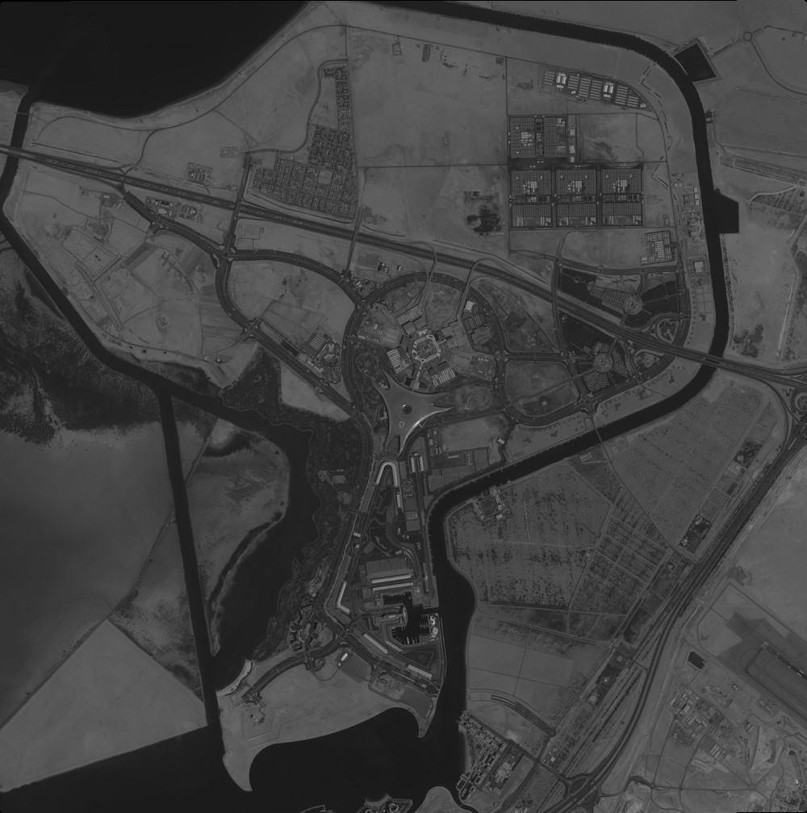
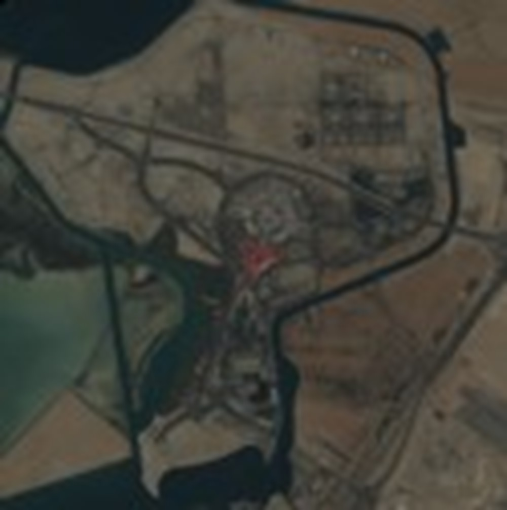
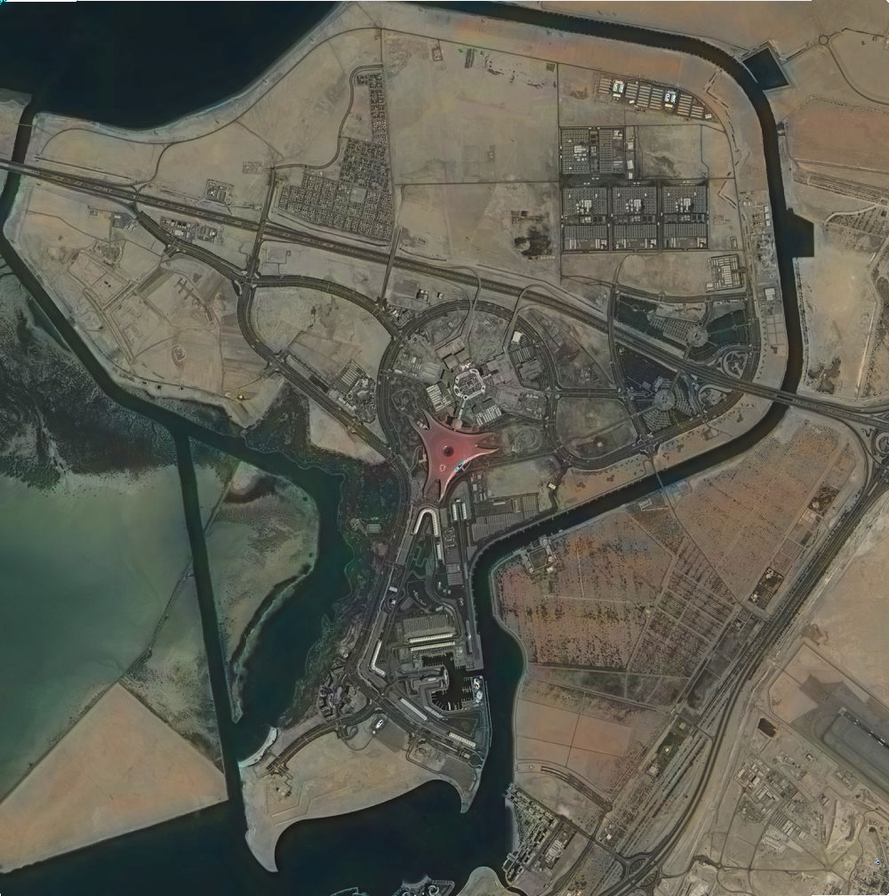
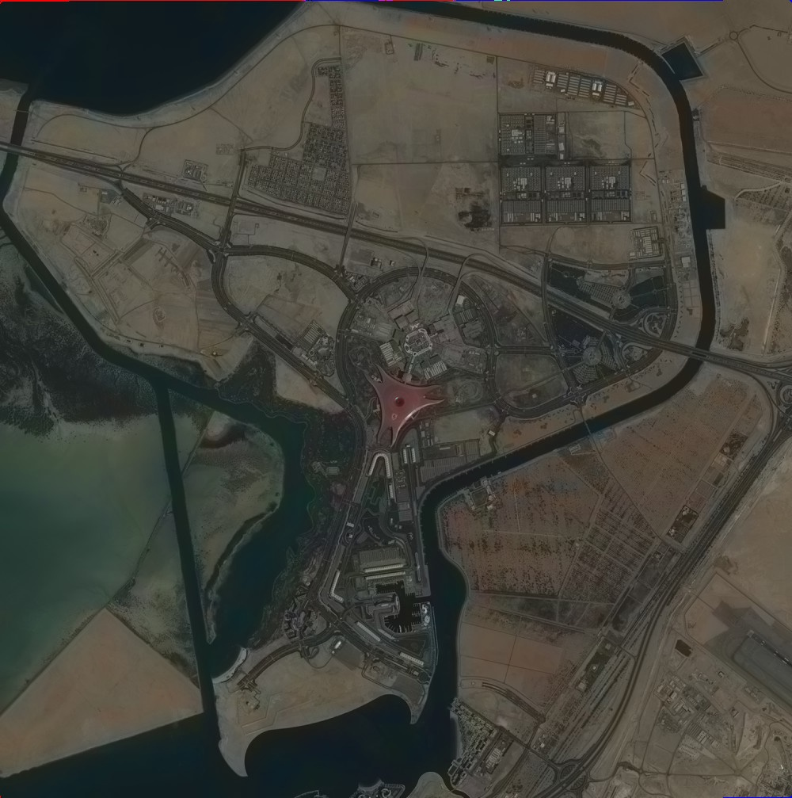
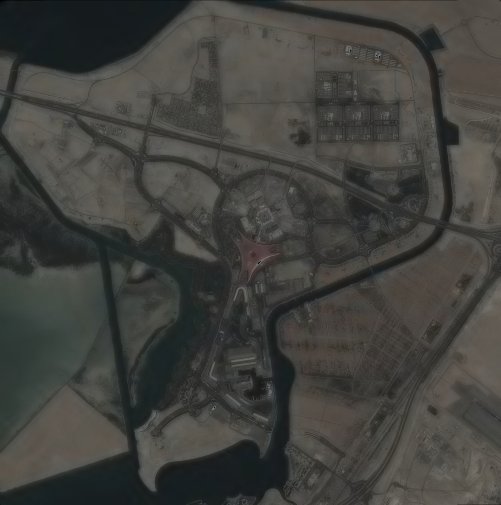

# Image Fusion with OpenCV

This Python script offers three image fusion methods using OpenCV: Brovey Pansharpening, Esri-style Fusion, and Simple Mean Fusion. These methods are commonly used in remote sensing and image processing applications.

## Brovey Pansharpening

The `brovey_pansharpen` function performs pansharpening on a multispectral image using the corresponding panchromatic image with the Brovey algorithm. The user can adjust the weight parameter (`W`) for customization.

## Esri-style Fusion

The `esri_fusion` function implements Esri-style image fusion using mean subtraction. It fuses a panchromatic image with a multispectral image to create a visually enhanced output.

## Simple Mean Fusion

The `simple_mean_fusion` function provides a basic image fusion method by taking the simple mean of corresponding pixel values in the panchromatic and multispectral images.

## Usage

```python
pan_path = 'path/to/panchromatic/image.jpg'
ms_path = 'path/to/multispectral/image.jpg'
output_path = 'path/to/output/fused_image.jpg'

# Choose the fusion method
# brovey_pansharpen(pan_path, ms_path, output_path)
# esri_fusion(pan_path, ms_path, output_path)
# simple_mean_fusion(pan_path, ms_path, output_path)
```

## Example

### Original Image
</img><br/>
</img><br/>

### Brovey
</img><br/>

### Esri
</img><br/>

### Simple Mean
</img><br/>

## License
All code and documentation in this project are available under the [MIT License](https://opensource.org/licenses/MIT).
See the [LICENSE file](./LICENSE) for details.

